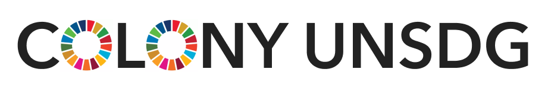

Develop the humanitarian within. Learn Truffle and Colony while applying the [UN Sustainable Development Goals](https://www.un.org/sustainabledevelopment/sustainable-development-goals/).

## Prerequisites

* Git >=2.6.4
* Node >=10.12.0
* Yarn >=1.12.0
* Docker >=18.09.0

_You may find it helpful to use Node Version Manager (`nvm`) to manage Node versions._

## Development

### Clone the repo

```
git clone https://github.com/fuguefoundation/truffle-colony-unsdg.git
cd truffle-colony-unsdg
```

### Initialize the Project

```
yarn initialize
```

Colony makes use of submodules. If you experience an error, it's possible you have not set up SSH keys with Github. check out [this doc](https://help.github.com/articles/generating-a-new-ssh-key-and-adding-it-to-the-ssh-agent/) for more information.

### Install Project Packages

```
yarn
```

### Start Network

Open a new terminal window and start [Ganache](https://github.com/trufflesuite/ganache-cli):

```
yarn start-ganache
```

### Deploy Contracts

Open a new terminal window and deploy the [colonyNetwork](https://github.com/JoinColony/colonyNetwork) contracts:

```
yarn deploy-contracts
```

### Start TrufflePig

Once the contracts have been deployed, start [TrufflePig](https://github.com/JoinColony/trufflepig):

```
yarn start-trufflepig
```

### Start Dev Server

Open a new terminal in the project root and start the Angular development server:

```
yarn start
```

### Open Your Browser

Open your browser and start saving the world!

[localhost:4200](http://localhost:4200)

### Run Tests

Open a new terminal window and run the tests:

```
yarn test
```